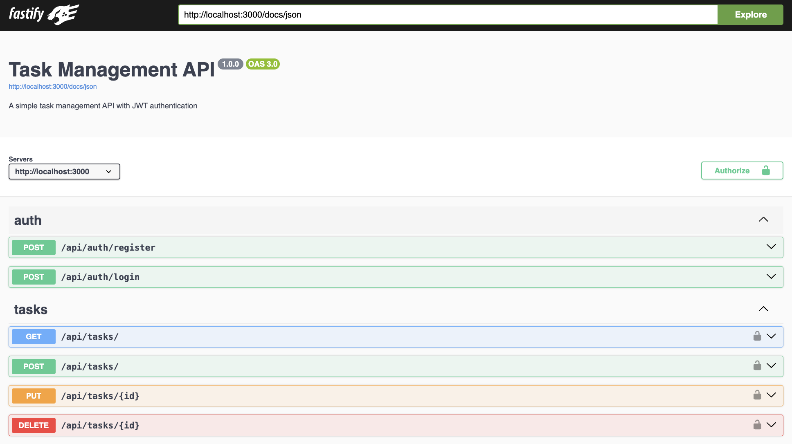

# Task Management API

A RESTful API for managing tasks with user authentication, built with Node.js, Fastify, and MongoDB.

## Features

- **User Authentication** - JWT-based authentication with registration and login
- **Task Management** - Create, read, update, and delete tasks
- **MongoDB Integration** - Persistent data storage with Mongoose ODM
- **Debug Endpoints** - Development endpoints for database inspection
- **API Documentation** - Interactive Swagger UI documentation
- **Security** - Password hashing with bcrypt and secure JWT tokens

## Prerequisites

Before running this application, make sure you have:

- **Node.js** (version 14 or higher)
- **npm** (comes with Node.js)
- **MongoDB** (local installation or MongoDB Atlas)

## Installation

### 1. Clone the Repository

```bash
git clone https://github.com/robbiewyu/node-js-proj
cd node_js_proj
```

### 2. Install Dependencies

```bash
npm install
```

### 3. Set Up MongoDB

**Example: Using Homebrew (macOS) and Community Edition 8.0:**
```bash
# Install MongoDB
brew tap mongodb/brew
brew update
brew install mongodb-community@8.0

# Start MongoDB service
brew services start mongodb-community@8.0

# Verify MongoDB is running
brew services list
```


### 4. Environment Variables (Optional)

Create a `.env` file in the root directory to customize settings:

```bash
# MongoDB connection string (optional - defaults to local MongoDB)
MONGODB_URI=mongodb://localhost:27017/taskmanager

# JWT secret key (optional - defaults to a simple key)
JWT_SECRET=your-secret-key-here
```

## Running the Application

### Development Mode (with auto-restart)

```bash
npm run dev
```

### Production Mode

```bash
npm start
```

The server will start on **http://localhost:3000**

## API Documentation

Once the server is running, you can access the interactive API documentation at:

**http://localhost:3000/docs**



## API Endpoints

### Authentication

- `POST /api/auth/register` - Register a new user
- `POST /api/auth/login` - Login and get JWT token

### Tasks (Requires Authentication)

- `GET /api/tasks` - Get all tasks for authenticated user
- `POST /api/tasks` - Create a new task
- `PUT /api/tasks/:id` - Update a specific task
- `DELETE /api/tasks/:id` - Delete a specific task

### Debug (Development Only)

First, uncomment the line 22 in src/app.js:

```js
// fastify.register(require('./routes/debug'), { prefix: '/api/debug' });
```

- `GET /api/debug/users` - View all users
- `GET /api/debug/tasks` - View all tasks
- `GET /api/debug/database-stats` - Get database statistics
- `GET /api/debug/user/:userId/tasks` - Get tasks for specific user

## Usage Examples

### 1. Register a New User

```bash
curl -X POST http://localhost:3000/api/auth/register \
  -H "Content-Type: application/json" \
  -d '{
    "email": "user@example.com",
    "password": "mypassword123"
  }'
```

### 2. Login

```bash
curl -X POST http://localhost:3000/api/auth/login \
  -H "Content-Type: application/json" \
  -d '{
    "email": "user@example.com", 
    "password": "mypassword123"
  }'
```

Save the `token` from the response for authenticated requests.

### 3. Create a Task

```bash
curl -X POST http://localhost:3000/api/tasks \
  -H "Content-Type: application/json" \
  -H "Authorization: Bearer YOUR_JWT_TOKEN" \
  -d '{
    "title": "My First Task",
    "description": "This is a test task",
    "completed": false
  }'
```

### 4. Get All Tasks

```bash
curl -X GET http://localhost:3000/api/tasks \
  -H "Authorization: Bearer YOUR_JWT_TOKEN"
```

## Database Schema

### User Model
```javascript
{
  _id: ObjectId,           // Auto-generated
  email: String,           // Required, unique
  password: String,        // Required (hashed with bcrypt)
  createdAt: Date         // Auto-generated
}
```

### Task Model
```javascript
{
  _id: ObjectId,           // Auto-generated
  title: String,           // Required
  description: String,     // Optional
  completed: Boolean,      // Default: false
  userId: ObjectId,        // Required, references User
  createdAt: Date         // Auto-generated
}
```

## Project Structure

```
src/
├── app.js              # Main application entry point
├── config/
│   ├── database.js     # MongoDB connection configuration
│   └── swagger.js      # Swagger documentation setup
├── middleware/
│   └── auth.js         # JWT authentication middleware
├── models/
│   ├── users.js        # User model and database operations
│   └── tasks.js        # Task model and database operations
├── plugins/
│   └── validators.js   # Centralized validation functions
└── routes/
    ├── auth.js         # Authentication routes
    ├── tasks.js        # Task management routes
    └── debug.js        # Debug/development routes
```
